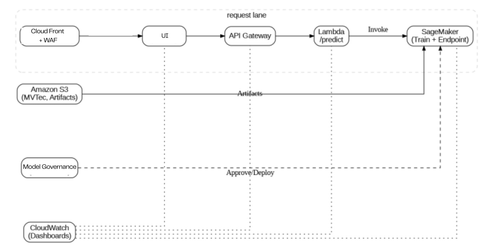

# IVADAS — Industrial Visual Anomaly Detection as a Service

IVADAS is a **cloud-native visual anomaly detection system** that demonstrates how modern anomaly detection models can be trained, evaluated, governed, and deployed as **secure, real-time ML services on AWS**.

This project focuses on **end-to-end ML system design**, including model training, inference deployment, governance, security, and observability.

---
## Team Members

- **Nanda Kiran Velaga**
- **Venkata Revanth Vardineni**
- **Phanindra Tupakula**
- **Hari Haran Manda**

---

## Project Highlights

- **Models**: PatchCore (baseline) and SoftPatch (candidate)
- **Dataset**: MVTec Anomaly Detection (multi-class)
- **Training & Deployment**: Amazon SageMaker Studio (JupyterLab)
- **Inference**: Real-time SageMaker Endpoints
- **Security**: CloudFront + AWS WAF (UI layer)
- **Monitoring**: Amazon CloudWatch
- **Governance**: SageMaker Model Dashboard

---

## Final System Architecture

The diagram below reflects the **final deployed architecture** of IVADAS.



### Request Flow

1. User accesses the UI via **CloudFront (protected by WAF)**
2. UI sends inference requests to **API Gateway**
3. API Gateway invokes **AWS Lambda (`/predict`)**
4. Lambda calls **SageMaker real-time inference endpoints**
5. Model artifacts and datasets are stored in **Amazon S3**
6. Monitoring is handled through **CloudWatch**
7. Model lineage and deployment state are tracked via **Model Governance / Dashboard**

---

## Models

### PatchCore — Baseline Model (v1)

- Memory-bank based anomaly detection method
- Strong image-level and pixel-level AUROC on MVTec AD
- Treated as the **production baseline**

**Model artifact (S3):**
```
s3://ivadas-data-722396408893/models/patchcore-mvtec-multiclass/patchcore_model.tar.gz
```

---

### SoftPatch — Candidate Model (v2)

- PatchCore extension with adaptive patch weighting
- Produces **anomaly heatmaps** for localization
- Deployed as a **candidate model** for comparison and future rollout

**Model artifact (S3):**
```
s3://ivadas-data-722396408893/models/softpatch_mvtec_all_classes.tar.gz
```

---

## Training & Deployment (SageMaker)

All development and deployment was performed using **Amazon SageMaker Studio (JupyterLab)**.

### Training

- Models trained inside SageMaker Studio notebooks
- Full MVTec AD dataset used (multi-class)
- Evaluation metrics (image-level and pixel-level AUROC) computed during training
- Artifacts and metrics stored in Amazon S3

### Deployment

- Trained models packaged as `model.tar.gz`
- Deployed as **real-time SageMaker inference endpoints**
- Separate endpoints used for PatchCore and SoftPatch

Deployment was performed **directly from SageMaker Studio**, without external CI/CD tooling.

---

## Dataset Setup (MVTec Anomaly Detection)

### 🔗 Dataset Download
https://www.mvtec.com/company/research/datasets/mvtec-ad

### 📁 Required Path

Place the dataset at:

```
patchcore-inspection/mvtec/
```

Expected structure:

```
patchcore-inspection/
└── mvtec/
    ├── bottle/
    ├── cable/
    ├── capsule/
    ├── carpet/
    ├── grid/
    ├── hazelnut/
    ├── leather/
    ├── metal_nut/
    ├── pill/
    ├── screw/
    ├── tile/
    ├── toothbrush/
    ├── transistor/
    ├── wood/
    └── zipper/
```

---

## User Interface

Used index.html for UI in S3 Bucket.

### CloudFront URL
```
https://d468m4bg4wc2w.cloudfront.net
```

### Direct S3 URL
```
https://ivadas-ui-722396408893.s3.us-east-1.amazonaws.com/index.html
```

---

## Lambda Function (Inference Orchestration)

This repository includes:

lambda_function.py

This Lambda function:
- Receives requests from API Gateway
- Decodes base64-encoded images
- Invokes the appropriate SageMaker endpoint (PatchCore or SoftPatch)
- Returns anomaly scores (and heatmaps where applicable)

Anyone wishing to recreate the API can deploy this file directly as an AWS Lambda function.

---

## Security & Monitoring

- AWS WAF attached to CloudFront
- HTTPS enforced
- Monitoring via Amazon CloudWatch

---

## Inference Request Format

```json
{
  "class_name": "bottle",
  "image_base64": "<base64-encoded-image>"
}
```

---

## 🎓 Course Context

Completed as part of **MSML650** (Cloud Computing) Final Project.
